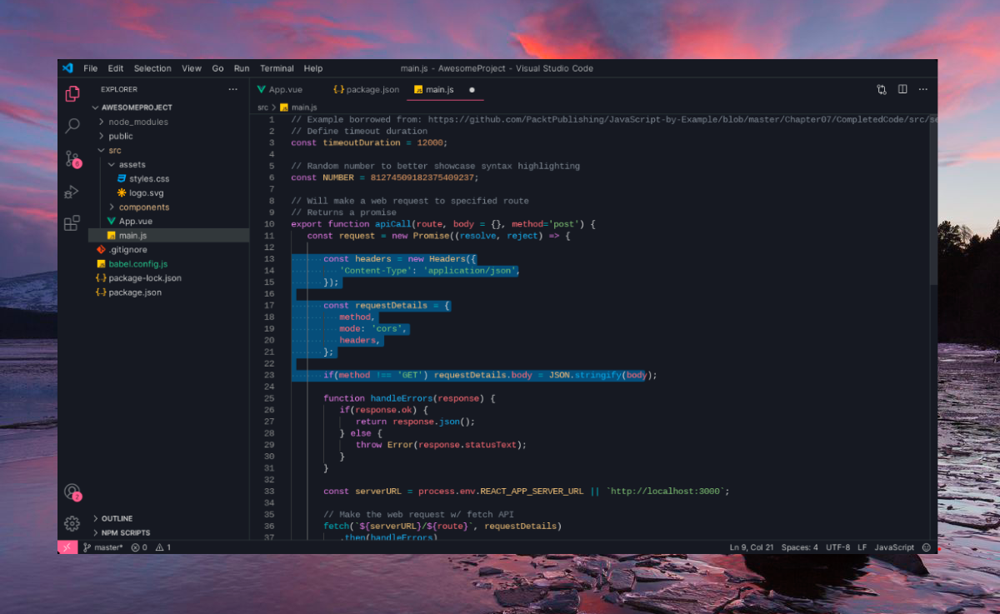

Immerse yourself in the captivating hues of a setting sun with Solar Flare, a VS Code theme that radiates warmth and energy. Inspired by the breathtaking spectacle of a sunset, Solar Flare's harmonious blend of fiery oranges, mellow yellows, and subtle purples creates a visually stunning and stimulating environment for your coding endeavors.

Designed for Productivity and Comfort

Solar Flare's carefully curated color palette not only enhances visual appeal but also promotes focus and comfort during extended coding sessions. The theme's balanced contrast ensures easy readability, while its thoughtfully chosen color combinations minimize eye strain, allowing you to maintain concentration and productivity throughout your coding journey.

